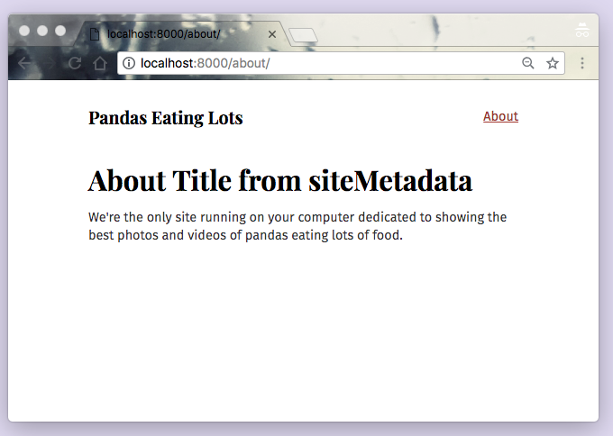
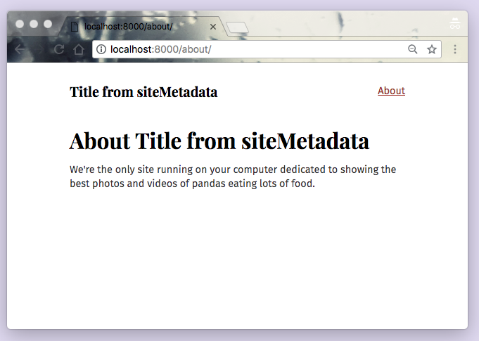
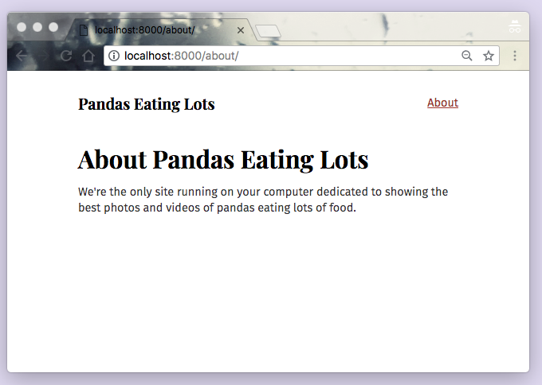

欢迎来到教程的第 4 章！你已经完成一半啦！希望你觉得事情开始变得轻松起来 😀

## 回顾教程的上半部分

目前，你已经学习了如何使用 React.js，并了解到创建你 _自己_ 的组件作为站点的构建模块是多么有效。

你还通过使用 CSS 模块探索了样式组件。

## 教程里还有什么?

在接下来的 4 章教程中（包含本章），你将深入 Gatsby 的数据层。它是一个非常强大的功能，使你能够轻松地从 Markdown、WordPress、headless CMS 和其他各种各样的数据源来构建站点。

**注意：** Gatsby 的数据层是由 GraphQL 驱动的。如果你想看 GraphQL 的深入教程，我们推荐这个网站：[如何 GraphQL](https://www.howtographql.com/)。

## Gatsby 中的数据

一个网站有四个部分：HTML、CSS、JS 和 数据。教程的上半部分专注于前三项。现在让我们学习怎么使用 Gatsby 站点中的数据。

**什么是数据?**

一个非常计算机科学风格的答案是：数据就是 `"字符串"（strings）`、整数 （`42`）、 对象 （`{ pizza: true }`）等等.

但是在 Gatsby 里面，一个更有用的答案是：“所有在 React 组件外的东西”。

目前你已经 _直接_ 在组件里面添加了一些文字和图片。这对于许多网站来说是一个 _非常好_ 的构建方式。但是，你会经常想要在组件 _外面_ 存储数据并按照需要把输入传入到组件 _里面_。

如果你正在用 WordPress（它为其他贡献者添加和维护内容提供了一个非常漂亮的界面）和 Gatsby 构建一个站点，网站的 _数据_（页面和文章）都在 WordPress 里面，你只要按需把数据 _提取_ 到你的组件里。

数据也可以在 Markdown、CSV之类的文件格式里，甚至数据库、API 等各种各样的形式。

**Gatsby 的数据层让你从这些（或其他任意）数据源中直接提取数据到你的组件里**——以你想要的形态存放。

## 对比非结构化数据与 GraphQL

### 我必须用 GraphQL 和数据源插件来把数据提取到 Gatsby 站点吗？

当然不是！你可以直接用节点 `createPages` API 把非结构化数据提取到 Gatsby 页面，而不是通过 GraphQL 数据层。这对于小型网站来说是一个非常好的选择。但是 GraphQL 和数据源插件可以帮你在构建复杂网站的时候节省时间。

阅读 [在不用 GraphQL 的情况下使用 Gatsby ](/docs/using-gatsby-without-graphql/) 这篇指南来学习如何使用节点 `createPages` API 来提取数据到你的 Gatsby 站点里！它包含了一个示例网站。

### 什么时候用非结构化数据？什么时候用 GraphQL？

如果你构建的是一个小型网站，一个非常高效的搭建的方式就是使用上面提到的 `createPages` API 提取非结构化数据。然后当这个站点变得越来越复杂，或者你要开发其他更加复杂的网站，亦或者你想要转换数据，做这几步：

1.  浏览 [插件库](/plugins/)，寻找你想用的数据源插件或数据转换插件
2.  如果找不到，阅读 [插件编写](/docs/creating-plugins/) 指南，考虑创建一个你自己的插件！

### Gatsby 的数据层是如何用 GraphQL 来把数据提取到组件里的

把数据加载到 React 组件里有许多方式。[GraphQL](http://graphql.org/) 是一个非常受欢迎且强大的技术。

GraphQL 是 Facebook 发明的，它能帮助项目工程师 _提取_ 所需数据到组件里。

GraphQL 是一种 **q**uery **l**anguage（查询语言）（名字中 QL 的由来）。如果你熟悉 SQL，它们的使用方式很像。通过一种特殊的语法，你就能描述你想要的组件中的数据，然后它就能把数据传给你。

Gatsby 使用 GraphQL 来使组件能够声明其所需的数据。

## 创建一个新的示例站点

在教程的这一部分，你要创建另一个新站点。你将建立一个名为 “Pandas Eating Lots” 的 Markdown 博客网站。这个博客的目的是展示一些性感熊猫在线吃竹的图片和视频。在此过程中，你将逐步深入 GraphQL 和 Gatsby 的 Markdown 支持。

打开一个新的终端窗口，然后在名为 “tutorial-part-four” 的目录中运行以下命令，创建一个新的Gatsby网站。然后导航到这个新目录：

```shell
gatsby new tutorial-part-four https://github.com/gatsbyjs/gatsby-starter-hello-world
cd tutorial-part-four
```

然后在项目的根目录安装其他一些所需的依赖项。你将使用 Typography 主题 “Kirkham”，和一个 CSS-in-JS 的库 ["Emotion"](https://emotion.sh/):

```shell
npm install --save gatsby-plugin-typography typography react-typography typography-theme-kirkham gatsby-plugin-emotion @emotion/core
```

建立一个和 [第 3 章](/tutorial/part-three) 中建立的站点相似的新站点. 这个站点要有一个布局组件和两个页面组件:

```jsx:title=src/components/layout.js
import React from "react"
import { css } from "@emotion/core"
import { Link } from "gatsby"

import { rhythm } from "../utils/typography"

export default ({ children }) => (
  <div
    css={css`
      margin: 0 auto;
      max-width: 700px;
      padding: ${rhythm(2)};
      padding-top: ${rhythm(1.5)};
    `}
  >
    <Link to={`/`}>
      <h3
        css={css`
          margin-bottom: ${rhythm(2)};
          display: inline-block;
          font-style: normal;
        `}
      >
        Pandas Eating Lots
      </h3>
    </Link>
    <Link
      to={`/about/`}
      css={css`
        float: right;
      `}
    >
      About
    </Link>
    {children}
  </div>
)
```

```jsx:title=src/pages/index.js
import React from "react"
import Layout from "../components/layout"

export default () => (
  <Layout>
    <h1>Amazing Pandas Eating Things</h1>
    <div>
      
    </div>
  </Layout>
)
```

```jsx:title=src/pages/about.js
import React from "react"
import Layout from "../components/layout"

export default () => (
  <Layout>
    <h1>About Pandas Eating Lots</h1>
    <p>
      We're the only site running on your computer dedicated to showing the best
      photos and videos of pandas eating lots of food.
    </p>
  </Layout>
)
```

```javascript:title=src/utils/typography.js
import Typography from "typography"
import kirkhamTheme from "typography-theme-kirkham"

const typography = new Typography(kirkhamTheme)

export default typography
export const rhythm = typography.rhythm
```

`gatsby-config.js` (必须在项目根目录, 不是 src 目录)

```javascript:title=gatsby-config.js
module.exports = {
  plugins: [
    `gatsby-plugin-emotion`,
    {
      resolve: `gatsby-plugin-typography`,
      options: {
        pathToConfigModule: `src/utils/typography`,
      },
    },
  ],
}
```

添加以上文件然后照常运行 `gatsby develop`，你应该会看到：


你有了另一个小型网站，包含一个布局和两个页面。

现在我们来开始查询数据 😋

## 你的第一个 GraphQL 查询语句

建立网站时，您可能需要重用一些常用的数据——比如 _网站标题_。查看 `/about/`页面，你会发现布局组件（网站标题）以及 `about.js` 页面的 `<h1 />` 页面标题）中都有网站标题（`Pandas Eating Lots`）。

但是如果你以后想更改站点名称怎么办？你必须在所有组件中搜索标题并修改每处地方。这既麻烦又容易出错，尤其是对于大型的复杂的站点。相反，你可以将标题存储在一个位置，并从其他文件引用该位置。你只要在这一个地方更改标题，Gatsby 就会将更新后的标题提取到引用它的文件中。

这些常用数据的存放位置就是 `gatsby-config.js` 文件中的 `siteMetadata` 对象。添加你的网站标题到 `gatsby-config.js` 文件里：

```javascript:title=gatsby-config.js
module.exports = {
  // highlight-start
  siteMetadata: {
    title: `Title from siteMetadata`,
  },
  // highlight-end
  plugins: [
    `gatsby-plugin-emotion`,
    {
      resolve: `gatsby-plugin-typography`,
      options: {
        pathToConfigModule: `src/utils/typography`,
      },
    },
  ],
}
```

重启开发服务器。

### 使用页面查询（page query）

现在网站标题能被查询到了。用 [页面查询](/docs/page-query) 把它添加到 `about.js` 文件里：

```jsx:title=src/pages/about.js
import React from "react"
import { graphql } from "gatsby" // highlight-line
import Layout from "../components/layout"

// highlight-next-line
export default ({ data }) => (
  <Layout>
    <h1>About {data.site.siteMetadata.title}</h1> {/* highlight-line */}
    <p>
      We're the only site running on your computer dedicated to showing the best
      photos and videos of pandas eating lots of food.
    </p>
  </Layout>
)

// highlight-start
export const query = graphql`
  query {
    site {
      siteMetadata {
        title
      }
    }
  }
`
// highlight-end
```

成功了！🎉



在以上 `about.js` 文件的改动中，获取 `title` 的基础 GraphQL 查询语句是：

```graphql:title=src/pages/about.js
{
  site {
    siteMetadata {
      title
    }
  }
}
```

> 💡 在 [第 5 章教程](/tutorial/part-five/#introducing-graphiql) 中，你将看到一个工具，它使我们可以交互式地通过 GraphQL 浏览可获得的数据，并帮我们编写类似于上面的查询语句。

Page queries live outside of the component definition -- by convention at the end of a page component file -- and are only available on page components.

页面查询定义在组件之外（一般在页面组件文件的最后），并且只在页面组件中可用。

### 使用 StaticQuery（静态查询）

[StaticQuery](/docs/static-query/) 是 Gatsby v2 中引入的新 API，这个 API 允许非页面组件（比如你的 `layout.js` 组件）通过 GraphQL 查询语句来获得数据。让我们使用最新引入的 hook 版本 — [`useStaticQuery`](/docs/use-static-query/).

我们继续对 `src/components/layout.js` 文件内容做一些更改。用 `useStaticQuery` hook 和一个 `{data.site.siteMetadata.title}` 引用来使用这个数据。改完后你的文件将如下所示：

```jsx:title=src/components/layout.js
import React from "react"
import { css } from "@emotion/core"
// highlight-next-line
import { useStaticQuery, Link, graphql } from "gatsby"

import { rhythm } from "../utils/typography"
// highlight-start
export default ({ children }) => {
  const data = useStaticQuery(
    graphql`
      query {
        site {
          siteMetadata {
            title
          }
        }
      }
    `
  )
  return (
    // highlight-end
    <div
      css={css`
        margin: 0 auto;
        max-width: 700px;
        padding: ${rhythm(2)};
        padding-top: ${rhythm(1.5)};
      `}
    >
      <Link to={`/`}>
        <h3
          css={css`
            margin-bottom: ${rhythm(2)};
            display: inline-block;
            font-style: normal;
          `}
        >
          {data.site.siteMetadata.title} {/* highlight-line */}
        </h3>
      </Link>
      <Link
        to={`/about/`}
        css={css`
          float: right;
        `}
      >
        About
      </Link>
      {children}
    </div>
    // highlight-start
  )
}
// highlight-end
```

又成功了！🎉



为什么在这里使用两种不同的查询语句？这些例子是对查询类型、格式设置以及在何处使用的简要介绍。目前你只要记住：只有页面可以进行页面查询。非页面组件（例如 Layout）可以使用 StaticQuery。本教程的 [第 7 章](/tutorial/part-seven/) 会对此进行更深入的说明。

让我们改回真正的标题。

Gatsby 的核心原则之一是 _创作者需要与他们创造的东西有实时联系_（[感谢 Bret Victor](http://blog.ezyang.com/2012/02/transcript-of-inventing-on-principle/)）。换句话说，当你对代码进行任何更改时，你应该立马看到该更改的效果。你在 Gatsby 中改变输入，在屏幕上就能看到新的输出。

因此几乎在任何时候，你所做的更改都会立即生效。再次编辑 `gatsby-config.js` 文件，这次将 `title` 改回 “Pandas Eating Lots”。所做的更改应很快显示在你的网站页面上。



## 接下来

下面你会在教程的 [第 5 章](/tutorial/part-five/) 中学习到如何使用 GraphQL 和数据源插件提取到你的 Gatsby 站点之中。
