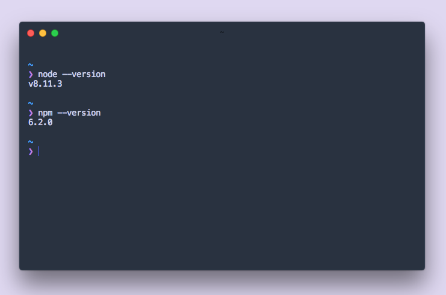
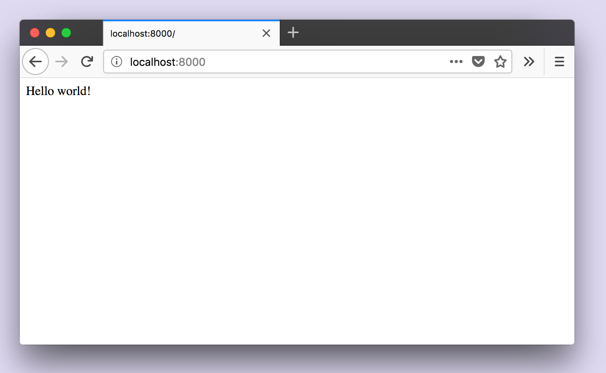

在开始创建第一个 Gatsby 网站之前，你需要熟悉一些核心 Web 技术，并确保已安装完所有必需的依赖、工具及环境。

## 熟悉命令行

命令行是基于文本的人机交互界面，用于在计算机上运行命令，也经常被称为终端。在本教程中，我们混用这两种叫法。像在 Mac 系统上使用 Finder 或在 Windows 系统上使用资源管理器一样。Finder 和资源管理器是图形用户界面（GUI）。而命令行是一种强大的基于文本的与计算机交互的方式。

找到并打开计算机的命令行界面（CLI）。 根据你使用的操作系统，请参阅 **[Mac 指令](http://www.macworld.co.uk/feature/mac-software/how-use-terminal-on-mac-3608274/)**，**[Windows 指令](https://www.quora.com/How-do-I-open-terminal-in-windows) **或 **[Linux 指令](https://www.howtogeek.com/140679/beginner-geek-how-to-start-using-the-linux-terminal/)**。

## 为 Node.js 安装 Homebrew

要安装 Gatsby 和 Node.js，建议使用 [Homebrew](https://brew.sh/)。 开始做一些设置可以免去以后很多麻烦！

如何在计算机上安装或验证 Homebrew 是否安装成功：

1. 打开命令行终端。
2. 命令行输入并运行 `brew -v` 来查看是否安装了 Homebrew 及其版本号。
3. 如果没有，根据操作系统（Mac，Linux 或 Windows）参照 [Homebrew及其说明](https://docs.brew.sh/Installation) 下载并安装。
4. 安装完 Homebrew 后，重复步骤2进行验证。

### Mac 用户：需安装 Xcode 命令行工具

1. 打开命令行终端。
2. 在 Mac 上，通过运行 `xcode-select --install` 安装 Xcode 命令行工具。
    1. 如果安装失败，请使用 Apple 开发者帐户登录 [直接从Apple网站下载](https://developer.apple.com/download/more/)。
3. 在提示你开始安装后，再次按提示接受软件许下载工具。

## ⌚ 安装 Node.js 和 npm 包管理工具

Node.js 是可以在 Web 浏览器之外运行 JavaScript 代码的环境。Gatsby 是使用 Node.js 构建的。 要启动和运行 Gatsby，你需要在计算机上安装最新版本 Node.js。

_注意：Gatsby 支持的最低 Node.js 版本是 Node v8.0.0，可以随时使用最新版本。_

1. 打开命令行终端。
2. 运行 `brew update` 以确保 Homebrew 更新到最新版。
3. 运行 `brew install node` 一次性安装 Node 和 npm。

完成安装步骤后，请确保所有内容均已正确安装：

### 验证 Node.js 是否安装成功

1. 打开命令行终端。
2. 运行 `node --version`。 （如果你不熟悉命令行，“运行 `command`”的意思是“在命令提示符下键入 `node --version`，然后按下 Enter 键。”现在开始，这就是我们所说的“运行 `command` ”）。
2. 运行 `npm --version`。

每个命令的输出结果应为版本号。 你的版本号可能与下面显示的版本不同！ 如果输入的命令没有显示版本号，请返回并确保 Node.js 是否已安装成功。



## 安装Git

Git 是一个免费的开源分布式版本管理系统，旨在快速高效地管理从小型到大型项目的所有内容。 当你创建一个 Gatsby “starter”（模版）站点时，Gatsby 会在后台使用 Git 来下载并安装启动程序所需的文件。 你将需要安装 Git 才能设置你的第一个 Gatsby 网站。

根据操作系统去相应下载和安装 Git，参照指南：

- [macOS 下安装 Git](https://www.atlassian.com/git/tutorials/install-git#mac-os-x)
- [Windows 下安装 Git](https://www.atlassian.com/git/tutorials/install-git#windows)
- [Linux 下安装 Git](https://www.atlassian.com/git/tutorials/install-git#linux)

## 使用Gatsby CLI

通过 Gatsby CLI 命令行工具，你可以快速创建由 Gatsby 支持的新站点，还可以运行用于开发 Gatsby 站点的其他命令。 它是一个已发布的 npm 包。

Gatsby CLI 可通过 npm 安装，命令行运行 `npm install -g gatsby-cli` 进行全局安装。

_**注意**: 当你首次安装并运行 Gatsby 时，会看到一条通知你有关为 Gatsby 命令收集的匿名使用数据的短消息，你可以阅读更多关于如何在 [远程测试文档](/docs/telemetry) 中提取和使用该数据的信息。_

要查看可用的命令，请运行 `gatsby --help`。


> 💡 如果由于权限问题而无法成功运行 Gatsby CLI，则可能需要查看 [有关修复npm权限的文档](https://docs.npmjs.com/getting-started/fixing-npm-permissions) 或 [本指南](https://github.com/sindresorhus/guides/blob/master/npm-global-without-sudo.md)。

## 创建一个 Gatsby 网站

现在，你可以使用 Gatsby CLI 工具创建第一个 Gatsby 站点。 使用该工具，你可以下载 “starter”（具有某些默认配置的部分构建的网站模版），以帮助你更快地创建特定类型的网站。 在此使用的 “Hello World” 的 “starter” 是具有 Gatsby 网站所需的所有基本知识的模版。

1. 打开命令行终端。
2. 运行`gatsby new hello-world https://github.com/gatsbyjs/gatsby-starter-hello-world`。 (_注意：根据你的下载速度，此过程所花费的时间会有所不同。为简便起见，下面的gif动画在部分安装过程中已暂停_)。
3. 运行`cd hello-world`。
4. 运行`gatsby develop`。

<video controls="controls" autoplay="true" loop="true">
  <source type="video/mp4" src="./03-create-site.mp4" />
  <p>Sorry! You browser doesn't support this video.</p>
</video>

刚刚发生了什么？

```shell
gatsby new hello-world https://github.com/gatsbyjs/gatsby-starter-hello-world
```

- `new` 是 gatsby 命令，用于创建新的 Gatsby 项目。
- 在这里，`hello-world` 是一个任意标题-你可以输入任何内容。 CLI 工具会将新站点的代码放置在名为 “hello-world” 的新文件夹中。
- 最后，GitHub URL 指向一个包含你要使用的模版代码的代码存储库。

```shell
cd hello-world
```

- 意思是将当前目录（cd）定位到 “hello-world” 子文件夹。 每当你要为站点运行任何命令时，都需要定位到该站点的目录中（即命令行终端需要指向站点代码所在的目录）。

```shell
gatsby develop
```

- 此命令启动了一个本地的开发服务器。 你将能够在本地开发环境中（在你的本地计算机上，而不是发布到网络上）查看新站点并与之交互。

### 本地查看你的网站

在浏览器中打开一个新标签，然后打开网址 [**http://localhost:8000**](http://localhost:8000/)。



恭喜！ 这是你第一个 Gatsby 网站的开始！ 🎉

只要你的开发服务器正在运行，你就可以通过链接 [**_http://localhost:8000_**](http://localhost:8000/) 在本地访问该网站。这就是你通过运行 `gatsby develop` 命令开启的进程。 要停止运行该进程（或 “停止运行开发服务器” ），请返回到命令行终端窗口，按住 “Control” 键，然后单击 “c” 键（ctrl+c）。 要重新启动，请再次运行 `gatsby develop`！

**注意：** 如果你正在使用 VM 虚拟机（如 “vagrant”）并希望能通过你的本地 IP 地址进行访问，请运行 `gatsby develop -- --host=0.0.0.0`。 现在，开发服务器已经运行在 “localhost” 和你的本地 IP 上。

## 设置代码编辑器

代码编辑器是专门设计用于编写计算机代码的程序。 有很多很棒的可供选择。

### 下载 VS Code

Gatsby 文档有时包含的屏幕截图是来自于 VS Code，因此，如果你还没有首选的代码编辑器，则建议使用 VS Code，确保你的屏幕看起来像教程和文档中的屏幕截图一样。 如果选择使用 VS Code，请访问 [VS Code网站](https://code.visualstudio.com/#alt-downloads) 并下载适合你平台的版本。

### 安装 Prettier 插件

建议使用 [Prettier](https://github.com/prettier/prettier)，该工具可帮助你格式化代码以避免错误。

你可以在编辑器中直接使用 Prettier，安装 [Prettier VS Code plugin](https://github.com/prettier/prettier-vscode)：

1. 在 VS Code 上打开扩展视图（查看=>扩展）。
2. 搜索 “Prettier - Code formatter”。
3. 单击 “安装”。 （安装后，系统将提示你重新启动 VS Code 以启用扩展。较新版本的 VS Code 将在下载后自动启用该扩展。）

> 💡 如果你不是使用 VS Code，请查看 Prettier 文档获取 [安装指引](https://prettier.io/docs/en/install.html) 或查看 [其他编辑器集成](https://prettier.io/docs/en/editors.html)。

## ➡️ 下一步

总结，在本节中介绍了：

- 学习命令行及其使用方法
- 安装并了解 Node.js、npm CLI 工具、项目版本管理工具 Git 和 Gatsby CLI 工具
- 使用 Gatsby CLI 工具创建了一个新的 Gatsby 网站
- 运行 Gatsby 本地开发服务器并在本地访问了你的站点
- 下载了代码编辑器
- 安装了 Prettier 代码格式化程序

现在，继续阅读 [**了解Gatsby模块构建**](/tutorial/part-one/)。

## 参考引用

### 核心技术概述

不要求精通这些方面的知识-如果你不是专家，请不要担心！ 在本教程系列的课程中，你将学到很多东西。 以下是构建 Gatsby 网站时将使用的一些主要 Web 技术：

- **HTML**：每个 Web 浏览器都能理解的标记语言。 它代表超文本标记语言。 HTML 为你的 Web 内容提供了通用的信息结构，定义了标题，段落等内容。
- **CSS**：一种样式表示语言，用于设置 Web 内容（字体，颜色，布局等）的样式。 它代表层叠样式表。
- **JavaScript**：一种编程语言，可帮助我们创建动态和交互式的网页。
- **React**：用于构建用户界面的代码框架（使用 JavaScript 构建）。这是 Gatsby 用来建立页面和内容结构的框架。
- **GraphQL**：一种数据查询语言，可助你将数据提取到你的网站中。 这是 Gatsby 用于管理网站数据的接口。

### 什么是网站？

要全面了解网站是什么（包括 HTML 和 CSS 简介），请查看“ [**建立你的第一个网页**](https://learn.shayhowe.com/html-css/building-your-first-web-page/)”。 这是开始学习 Web 知识的好地方。 有关 [**HTML**](https://www.codecademy.com/learn/learn-html)，[**CSS**](https://www.codecademy.com/learn/learn-css) 和 [**JavaScript**](https://www.codecademy.com/learn/introduction-to-javascript)，请参阅 Codecademy 的教程。[**React**](https://reactjs.org/tutorial/tutorial.html) 和 [**GraphQL**](http://graphql.org/graphql-js/) 也有自己的入门教程 。

### 了解有关命令行的更多信息

有关使用命令行的较好的介绍，请查看适用于 Mac 和 Linux 用户的 [**Codecademy的命令行教程**](https://www.codecademy.com/courses/learn-the-command-line/lessons/navigation/exercises/your-first-command)，以及 [**此教程**](https://www.computerhope.com/issues/chusedos.htm)（适用于Windows用户）。 即使你是 Windows 用户，Codecademy 教程的第一页也是非常有价值的内容。 它不仅介绍如何与之交互，还解释了什么是命令行。

### 了解有关npm的更多信息

npm 是一个 JavaScript 包管理器。 一个包是一个你可以选择将其包含在项目中的代码模块。 如果你已经下载并安装了 Node.js，则 npm 已经受附带安装了！

npm 有三个不同的组成部分：npm 的网站，npm 注册表和 npm 命令行界面（CLI）。

- 在 npm 网站上，你可以浏览在 npm 注册表中可用的 JavaScript 代码包。
- npm 注册表是一个大型数据库，其中包含有关 npm 上可用的 JavaScript 代码包的信息。
- 确定所需的代码包后，可以使用 npm CLI 将其安装到项目中或全局安装（如其他 CLI 工具一样）。npm CLI 是与 npm 注册表对话的对象——通常，你仅需与 npm 网站或 npm CLI 进行交互。

> 💡 查看 npm 的介绍，“[**什么是npm？**](https://docs.npmjs.com/getting-started/what-is-npm)”。

### 了解有关 Git 的更多信息

你无需了解 Git 即可完成本教程，但这是一个非常有用的工具。 如果你想了解有关版本控制、Git 和 GitHub 的更多信息，请查看 GitHub 的 [Git手册](https://guides.github.com/introduction/git-handbook/)。

